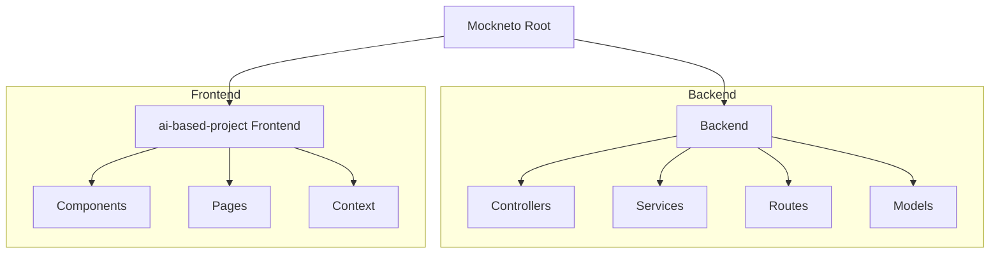

# 🎯 Mockneto: AI-Powered Interview Preparation Platform

Mockneto is a state-of-the-art platform designed to revolutionize the way candidates prepare for interviews. By leveraging the power of Gemini AI, Mockneto provides realistic, interactive mock interview sessions, real-time feedback, and comprehensive progress tracking to help users land their dream jobs.

---

## ✨ Key Features

- **🤖 AI-Driven Interviews**: Interactive mock interviews tailord to Tech and MBA tracks, powered by Google's Gemini AI.
- **📈 Progress Dashboard**: Visualize your growth with detailed analytics and score trends over time.
- **🔐 Secure Authentication**: Robust user management with optional Google OAuth integration.
- **⚡ Service/Controller Architecture**: High-quality, maintainable backend code structure for scalability.
- **🎙️ Real-time Feedback**: Instant AI-generated analysis of your performance and areas for improvement.

---

## 🛠️ Technology Stack

| Component | Technology |
| :--- | :--- |
| **Frontend** | React, Vite, Tailwind CSS |
| **Backend** | Node.js, Express.js |
| **Database** | MongoDB (Mongoose ODM) |
| **AI Engine** | Gemini AI (Google Generative AI) |
| **State Mgt** | React Context API |

---

## 🏗️ Project Structure



---

## 🚀 Getting Started

### Prerequisites

- Node.js (v18+)
- MongoDB connection string
- Gemini AI API Key

### Backend Setup

1. Navigate to the backend directory:
   ```bash
   cd Backend
   ```
2. Install dependencies:
   ```bash
   npm install
   ```
3. Configure environment variables in `.env`:
   ```env
   PORT=5600
   MONGO_URI=your_mongodb_uri
   GEMINI_API_KEY=your_api_key
   ```
4. Start the server:
   ```bash
   npm start
   ```

### Frontend Setup

1. Navigate to the frontend directory:
   ```bash
   cd ai-based-project
   ```
2. Install dependencies:
   ```bash
   npm install
   ```
3. Start the Vite development server:
   ```bash
   npm run dev
   ```

---

## 🏗️ Architecture Note

Mockneto has recently migrated to a **Service/Controller/Repository** pattern. 
- **Controllers**: Handle incoming requests and response formatting.
- **Services**: Contain the core business logic and AI orchestration.
- **Routes**: Define the API endpoints and wire them to controllers.

---

## 🤝 Contributing

We welcome contributions! Please follow the established coding patterns and ensure all new features are properly documented.

---

## 📄 License

This project is licensed under the MIT License - see the [LICENSE](LICENSE) file for details.